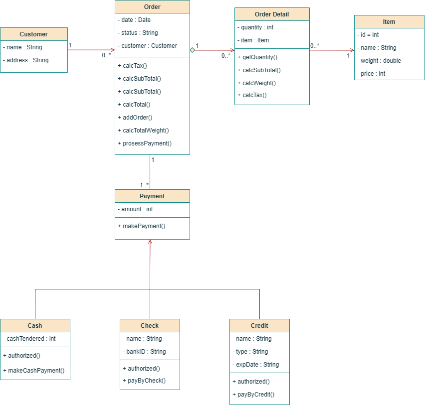

# Implementasi class diagram "Order System" ke kode java
#### github.com/78lukman

## Diagram

## Fitur :

1. Tambah Pelanggan
2. Buat Pesanan
3. Lihat Pesanan
4. Lihat Pelanggan
5. Proses Pembayaran

### $\color{orange}{\textsf{Tambah Pelanggan :}}$
Menambahkan data pelanggan meliputi nama dan alamat

### $\color{orange}{\textsf{Buat Pesanan :}}$
Simulasi membeli item dengan memasukkan nama peelanggan kemudian memasukkan item yang tersedia

### $\color{orange}{\textsf{Lihat Pesanan :}}$
Untuk melihat pesanan berdasarkan nama pelanggan. Pengguna akan diminta untuk memasukkan nama pelanggan mana yang akan dilihat data pesanannya

### $\color{orange}{\textsf{Lihat Pelanggan :}}$
Untuk melihat semua data pelanggan baik nama ataupun alamat.

### $\color{orange}{\textsf{Proses Bayar :}}$
Digunakan untuk simulasi pembayaran baik secara cash, credit, ataupun check. Kali pertama menambahkan pesanan statusnya akan "Menunggu Pembayaran", namun setelah melakukan pembayaran maka setatus tersebut berubah menjadi "Lunas".

## Cara Menjalankan Program
- masuk ke folder class-diagram-order-system
- jalankan perintah compile : $\color{yellow}{\textsf{javac *.java}}$
- jalankan file Main.java : $\color{yellow}{\textsf{java Main.java}}$
## note :

- bankID : 14197
- ubah amount (saldo anda) dibagian parameter payment method, misal

  payment = new Check($\color{lime}{\textsf{500000}}$, checkName, bankID);
- untuk menambahkan data items, silahkan tambahkan datanya di file items.data. Misal :
  
| id | nama barang | harga | berat(gr) |
|----|-------------|-------|-----------|
| 6  | Sandal      | 10500 | 90.5      |
| 7  | Topi        | 25000 | 120       |

- format penulisan data : <code>id,"nama_item",harga,berat</code>

  maka data diatas ditulis menjadi :

  6,"Sandal",10500,90.5

  7,"Topi",25000,120

